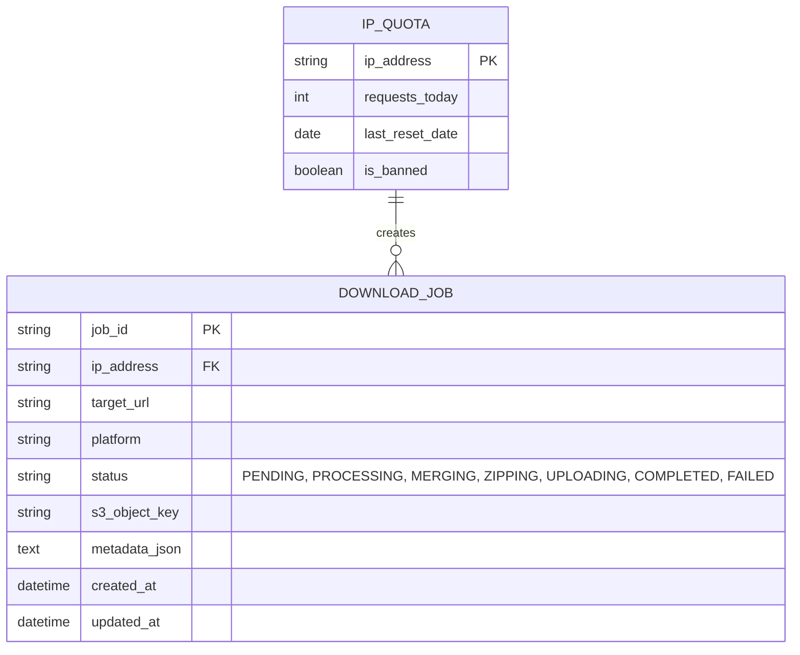
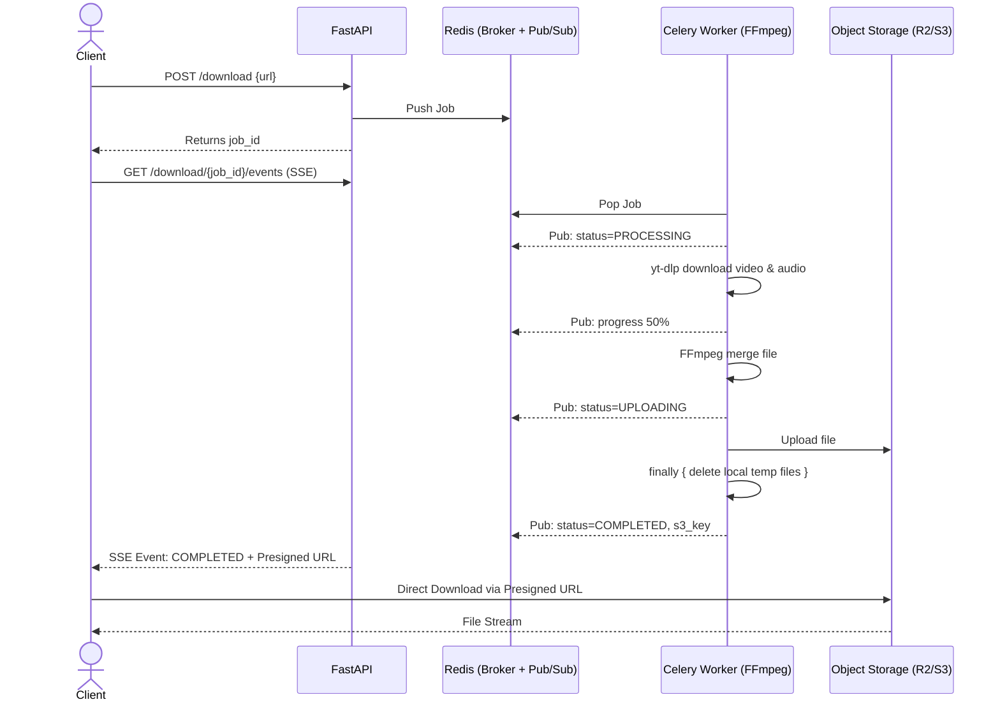

# Technical Design Document (TDD) - Tải Mọi Thứ (All-in-One Video Downloader)

**Status:** Draft | **Version:** 2.0 | **Date:** 2026-05-30
**Role:** Staff Software Engineer / Solution Architect

---

## 1. Overview

### 1.1 Bài toán (Problem Statement)

Hệ thống cần cung cấp một nền tảng tải video/âm thanh từ nhiều mạng xã hội thông qua một ô nhập liệu duy nhất. Thách thức lớn nhất nằm ở việc xử lý tải và gộp luồng (ví dụ: video 1080p+ trên YouTube tách biệt luồng âm thanh và hình ảnh), quản lý tài nguyên máy chủ để ngăn chặn lạm dụng (bandwidth, CPU), bảo mật chống SSRF, và mở rộng quy mô đồng thời duy trì trải nghiệm người dùng tối ưu.

### 1.2 Mục tiêu kỹ thuật (Technical Goals)

- **Reliability:** Đảm bảo tỷ lệ thành công của việc phân tích URL > 95%.
- **Performance:** Bắt đầu tiến trình tải dữ liệu về client trong vòng < 5 giây từ lúc request.
- **Resource Efficiency:** Zero Egress Cost cho VPS Backend bằng cách đưa luồng tải file lớn trực tiếp từ Object Storage (S3/Cloudflare R2) về Client.
- **Security:** Chặn 100% các cuộc tấn công SSRF (bằng DNS Resolution) và lạm dụng băng thông.

### 1.3 Phạm vi triển khai (Scope V1)

- **Platforms:** YouTube, TikTok, Facebook, Instagram, Twitter/X.
- **Core Features:** Analyze URL, chọn chất lượng (Audio/Video), tải đơn lẻ, tải hàng loạt (có nén ZIP, giới hạn 5 URL/batch), Rate Limiting.
- **UI/UX:** SEO Landing Pages, Platform Health Badge (hiển thị trạng thái hoạt động của nền tảng), Popup hướng dẫn lưu file trên iOS Safari.
- **Monetization:** Freemium model (10 lượt/ngày/IP).

### 1.4 Ngoài phạm vi (Out of Scope V1)

- Tải từ các nền tảng khác (Reddit, Twitch, Bilibili...).
- Tải Playlist, Kênh (Channel) hoặc Livestream đang phát.
- Hệ thống User Account, Đăng nhập, Thanh toán.

---

## 2. Requirements Analysis

### 2.1 Mapping PRD to Technical Requirements

| PRD ID  | Tính năng          | Technical Requirement                                             |
| ------- | ------------------ | ----------------------------------------------------------------- |
| PRD-F01 | Auto Detection     | API xác thực URL, sử dụng Built-in Extractor của `yt-dlp`.        |
| PRD-F02 | Quality Selection  | Trả về mảng các `format_id` khả dụng từ `yt-dlp` metadata.        |
| PRD-F03 | Single Download    | Endpoint `POST /api/v1/download` đẩy Job vào Celery.              |
| PRD-F04 | Batch Download     | Worker chuyên biệt xử lý nén ZIP trước khi upload lên S3.         |
| PRD-F05 | Progress Tracking  | SSE (Server-Sent Events) kết hợp Redis Pub/Sub đẩy trạng thái.    |
| PRD-SEC | Rate Limit & Quota | Redis rate limiter + PostgreSQL tracking IP quota.                |
| PRD-UX1 | iOS Safari Popup   | Frontend phát hiện `User-Agent` iOS để trigger hướng dẫn tải.     |
| PRD-UX2 | SEO & Health Badge | Cấu hình SSR cho landing pages, API `/health/platforms`.          |

### 2.2 Assumptions & Dependencies

- **Dependencies:** Thư viện `yt-dlp` (Core engine), `FFmpeg` (Merging tool), PostgreSQL, Redis, Cloudflare R2 / AWS S3 (Object Storage).

### 2.3 Non-functional Requirements (NFRs)

- **Concurrency:** Hỗ trợ tối thiểu 50 user thao tác đồng thời.
- **Availability:** Uptime 99.9%.
- **Data Retention:** Worker tự dọn dẹp file tạm ở Local ngay sau khi upload S3. Link Presigned S3 chỉ tồn tại trong 15 phút.

---

## 3. High-Level Architecture (Event-Driven + Object Storage)

Hệ thống được thiết kế theo kiến trúc Micro-Monolith bất đồng bộ, sử dụng Event-Driven để Worker và API Server giao tiếp qua Redis Pub/Sub, và Offload toàn bộ Egress Bandwidth qua Object Storage.

```mermaid
graph TD
    Client[Client Browser (React)] -->|Cloudflare WAF| Nginx[Nginx Reverse Proxy]
    Nginx --> FastAPI[FastAPI Backend]

    subgraph Core API
        FastAPI --> RateLimiter[Redis Rate Limiter]
        FastAPI --> DB[(PostgreSQL)]
    end

    subgraph Job Processing
        FastAPI -->|Push Task| RedisQ[Redis Message Broker]
        RedisQ --> CeleryWorker1[Worker - Direct Stream]
        RedisQ --> CeleryWorker2[Worker - FFmpeg/ZIP]
        CeleryWorker2 --> FFmpeg[FFmpeg Subprocess]
    end

    subgraph Storage & External
        CeleryWorker1 -->|Upload File| S3[Cloudflare R2 / S3]
        CeleryWorker2 -->|Upload File/ZIP| S3
        FastAPI -->|Sub| RedisPubSub[Redis Pub/Sub]
        CeleryWorker1 -.->|Pub Progress| RedisPubSub
        CeleryWorker2 -.->|Pub Progress| RedisPubSub
        FastAPI -.->|SSE Progress/Presigned URL| Client
        Client ==>|Direct Download via Presigned URL| S3
        
        CeleryWorker1 -->|Download Data| YTDLP_API[yt-dlp Sandbox]
        YTDLP_API --> TargetPlatforms(YouTube, TikTok, FB...)
    end
```

---

## 4. Detailed System Design

### 4.1 Frontend Application (React + Vite)

- **Trách nhiệm:** Render UI, validate form, duy trì kết nối SSE để nhận tiến trình (`processing`, `eta`, `speed`). Khi nhận sự kiện `COMPLETED`, tự động redirect/tạo thẻ `<a>` tải file từ S3 Presigned URL.
- **UX Đặc thù:** Hỗ trợ hiển thị Health Badge cho từng platform, detect iOS Safari hiển thị popup "Hướng dẫn lưu vào Tệp".

### 4.2 FastAPI Backend

- **Trách nhiệm:** RESTful API, tạo S3 Presigned URL.
- **Non-blocking `yt-dlp`:** Mọi tác vụ gọi `yt-dlp.extract_info()` tại API (để lấy metadata) phải được bọc trong `asyncio.to_thread()` hoặc `ThreadPoolExecutor` để KHÔNG block Async Event Loop của FastAPI.

### 4.3 yt-dlp Integration & Sandboxing

- Chạy `yt-dlp` trong một **Docker Container / Network Namespace bị hạn chế (Sandbox)** không có quyền truy cập LAN.
- Sử dụng tham số `--no-exec` để ngăn chặn Remote Code Execution (RCE) qua metadata extractor.
- Giao phó logic routing platform cho built-in extractor của `yt-dlp`, regex backend chỉ dùng để pre-validate định dạng URL ban đầu.

### 4.4 Redis Pub/Sub & SSE Delivery

- **Payload Progress (SSE):**
  ```json
  {"job_id": "xxx", "status": "PROCESSING", "progress": 45, "speed": "2.5MB/s", "eta": "12s"}
  ```
- **Payload Completed:**
  ```json
  {"job_id": "xxx", "status": "COMPLETED", "download_url": "https://r2.cloudflare.com/...X-Amz-Signature=..."}
  ```

### 4.5 Celery Worker & Job Management

- **Phân tách Queue:** Queue Nhanh (Direct Stream cho TikTok/FB/IG) và Queue Chậm (FFmpeg/ZIP cho YouTube 1080p, Batch).
- **Cấu hình OOM & Concurrency:** Khởi chạy Worker FFmpeg với `--concurrency=2` và `--max-tasks-per-child=10` để tránh memory leak và OOM kill server.
- **Graceful Shutdown:** Lắng nghe signal `worker_shutting_down`, catch và Requeue (đẩy lại trạng thái PENDING) để job không bị treo.

### 4.6 File Lifecycle & Cleanup Strategy

- **Tránh Race Condition:** KHÔNG dùng cronjob để xóa file dựa theo giờ.
- **Nguyên tắc:** Mỗi Celery Task tự tạo file trong thư mục tạm độc lập và bắt buộc xóa trong block `finally` sau khi hoàn thành/lỗi.
- **Cronjob Safety Net:** Chỉ dọn dẹp các file rác (Orphan) có thời gian tồn tại lớn hơn **3 giờ** trong `/tmp`.

---

## 5. Database Design

Sử dụng **PostgreSQL** để đảm bảo tính an toàn dữ liệu, tránh tình trạng Database Locked khi nhiều Worker liên tục Write trạng thái so với SQLite. 



---

## 6. API Design

### 6.1 `POST /api/v1/analyze`
- Phân tích URL (sử dụng `asyncio.to_thread()`), trả về thông tin metadata và format_id. Được cache qua Redis (30 phút, Key = Normalized Video ID).

### 6.2 `POST /api/v1/download` (Single Download)
- **Request:** `{ "url": "https://...", "format_id": "best" }`
- **Response:** `{ "job_id": "uuid" }`

### 6.3 `POST /api/v1/download/batch`
- **Request:** `{ "urls": ["url1", "url2"], "format_preference": "best" }` (Max 5 URLs).
- **Response:** `{ "batch_id": "uuid" }`

### 6.4 `GET /api/v1/download/{job_id}/events`
- Endpoint duy trì kết nối SSE cho Client. FastAPI subscribe vào Redis Channel `job:{job_id}` và đẩy event về client.

---

## 7. Sequence Diagrams

### 7.1 Luồng Tải Đơn Lẻ (Single Download - FFmpeg)



### 7.2 Luồng Tải Hàng Loạt (Batch - ZIP)

- **Workflow:** Worker tải lần lượt N file -> Lưu tạm Local -> Dùng `zipfile` nén lại -> Upload file `.zip` lên S3 -> Publish SSE báo hoàn thành kèm Presigned URL file ZIP -> Cleanup Local.

---

## 8. Security Considerations

1. **Chống SSRF Triệt Để (DNS Resolution):**
   - Lấy URL đầu vào -> Lấy Hostname -> **Resolve ra IP thực tế**.
   - Kiểm tra IP đã resolve không thuộc các dải private (`127.0.0.0/8`, `10.0.0.0/8`, `192.168.0.0/16`, `169.254.0.0/16`), vòng lặp IPv6 (`::1`), hoặc IPv4-mapped.
   - Cấu hình HTTP Client chặn theo sát HTTP Redirects, hoặc validate IP ở mỗi hop redirect.
2. **Ngăn chặn XSS qua Metadata:** Backend sanitize tất cả title/description string nhận từ `yt-dlp` trước khi trả qua API.
3. **Bandwidth Egress Abuse:** Việc offload file qua Cloudflare R2 giải quyết hoàn toàn bài toán quá tải băng thông VPS.
4. **Client IP Spoofing:** Cấu hình FastAPI sử dụng trusted header `CF-Connecting-IP` khi triển khai sau Cloudflare để Rate Limiting chính xác.

---

## 9. Scalability & Performance

- **Zero Egress Architecture:** Máy chủ API và Worker chỉ tốn băng thông đẩy lên (Ingress/Egress nội bộ cloud), client nhận file từ R2. Chi phí mạng băng thông sẽ giảm tới 90%.
- **Horizontal Scaling Worker:** Việc lưu file trung gian trên Local được thay bằng S3. Worker Nodes giờ hoàn toàn Stateless, có thể thêm bất cứ lúc nào trên nhiều máy chủ khác nhau mà API không bị mất connection tới file.
- **Cache Invalidation:** Cache Key dựa trên Normalize Video ID, TTL 30 phút. Tránh cache các link file trực tiếp vì chúng có thể hết hạn (Token expired từ phía platform).

---

## 10. Monitoring & Observability

- **Metrics cần thu thập:** 
  - `download_success_rate` theo từng Platform.
  - `active_sse_connections`.
  - `temp_disk_usage_bytes` trên các worker nodes.
  - `api_response_time_p95`.
- **Health Checks:** Endpoint `/health` kiểm tra kết nối PostgreSQL, Redis. Endpoint `/health/platforms` kích hoạt `yt-dlp` dummy request để kiểm tra các platform có đang bị khóa bóng hay không (phục vụ Platform Health Badge hiển thị ở UI).

---

## 11. Failure Scenarios & Edge Cases

| Tình huống                        | Expected Behavior                   | Fallback Strategy                                            |
| --------------------------------- | ----------------------------------- | ------------------------------------------------------------ |
| Worker bị OOM / Kill giữa chừng   | Job bị dừng đột ngột.               | Sử dụng `worker_shutting_down` requeue Job, cấu hình Redis Visibility Timeout. |
| URL chứa DNS Rebinding            | FastAPI raise Exception 400.        | Cơ chế SSRF Prevention chặn ngay ở bước IP Resolution.       |
| Cronjob quét file                 | Không xóa file đang được xử lý.     | Mỗi Task tự clean file của mình trong `finally`. Cronjob chỉ dọn rác > 3 tiếng. |
| Client ngắt kết nối khi đang tải  | SSE đứt kết nối.                    | Worker VẪN tải lên S3 hoàn tất (chuẩn bị cho lần retry sau). User nhấn thử lại sẽ lấy luôn cache URL. |
| Một phần trong Batch bị lỗi       | Worker bỏ qua file lỗi, nén các file thành công. | Ghi chú các file lỗi vào file `report.txt` đính kèm trong ZIP. |

---

## 12. Rollout Plan & Testing Strategy

1. **Development:** Localhost docker-compose (Redis, FastAPI, PostgreSQL, Worker).
2. **Staging:** Triển khai Backend API lên Railway, Worker Server riêng biệt (có đủ RAM chạy FFmpeg). Sử dụng Cloudflare R2 (Free Tier cho Egress). 
3. **Production:** Gắn Cloudflare WAF, bật Bot Fight Mode.
4. **Testing:** Unit test regex/DNS Resolver SSRF. E2E test đặc tả luồng SSE và S3 Presigned URL.
